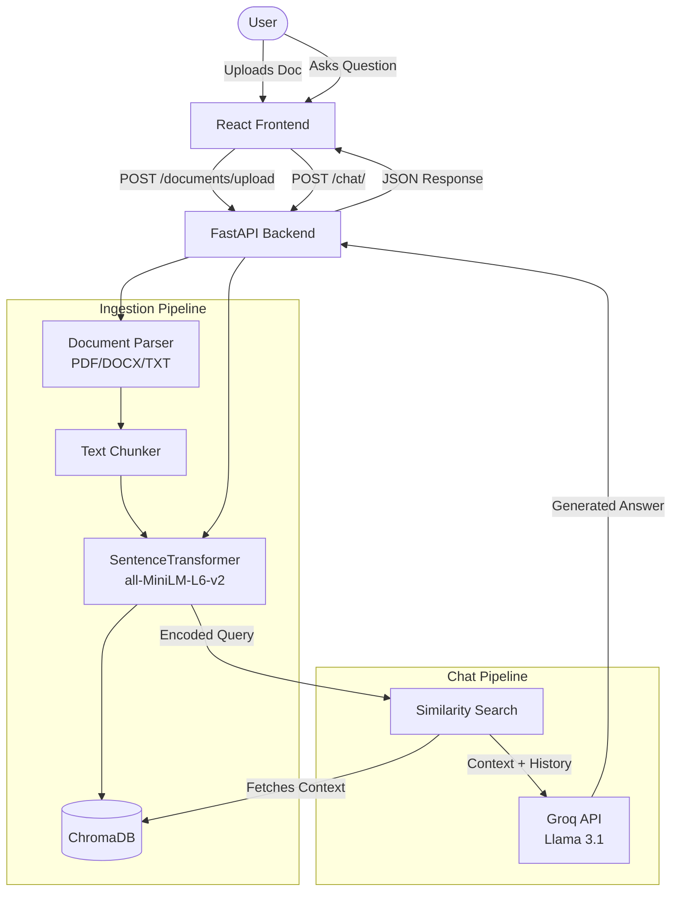

# System Architecture

This document outlines the high-level architecture and data flow for the Intelligent Customer Support AI Assistant.

## High-Level Data Flow

The system is broken down into two primary pipelines:
1. **The Ingestion Pipeline:** For parsing, chunking, and embedding documents into the vector database.
2. **The Chat Pipeline:** For retrieving relevant context and generating conversational responses using Groq.

## Component Breakdown

- **React Frontend**: Built with Vite and Vanilla CSS, providing a glassmorphic chat UI and drag-and-drop document upload interface.
- **FastAPI Backend**: Handles routing, orchestration, and API validation.
- **Sentence-Transformers**: A local embedding model (`all-MiniLM-L6-v2`) used to convert text chunks and user queries into high-dimensional vectors for semantic search.
- **ChromaDB**: A local vector database that persists to `./chroma_db` and handles fast similarity search.
- **Groq API**: Provides the Llama 3.1 8B Instant model, responsible for synthesizing the final answer based on the retrieved context.
- **PostgreSQL**: Kept available for storing structured relational data like conversation history or user metadata.
